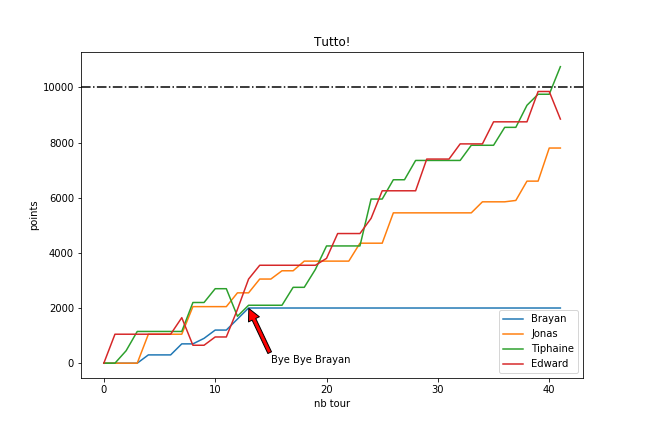

* TOC {:toc}

# Pour commencer
Dans matplotlib, il y a deux "objets" principaux:

* Les figures: on peut les considérer comme les "fenêtres"
* Les axes: ils vont contenir les courbes

Chaque figure peut contenir un ou plusieurs axes.

Pour utiliser matplotlib, il suffit la plupart du temps d'importer la partie "pyplot" de matplotlib.

```PYTHON
import matplotlib.pyplot as plt
```

# Les différentes approches de Matplotlib

Matplotlib permet plusieurs approches pour créer des graphiques. 

## La plus simple (et la moins recommandée)

Cette approche est utile si l'on n'a qu'une seule figure avec qu'un seul axe.

```PYTHON
import matplotlib.pyplot as plt
 

## On crée nos données
x =[1,2,3,4,5,6,7,8,9,10]
y =[2,6,3,7,1,4,6,8,3,11]

plt.plot(x,y) # plt.plot() utilisé pour nuages de points (reliés ou pas) 
plt.show()
```
## La plus complète (recommandée)

avec cette technique on utilise les figures et les axes.

```PYTHON
import matplotlib.pyplot as plt

# On crée nos données
x =[1,2,3,4,5,6,7,8,9,10]
y =[2,6,3,7,1,4,6,8,3,11]

fig,ax = plt.subplots() # on crée une figure et un axe
ax.plot(x,y) # on plot sur cet axe en particulier

plt.show()
```
Cette technique permet de configurer indépendemment les axes (par exemple mettre en échelle logarithmiques)

Pour avoir plusieurs 

|||
|-|-|
||
|||


## Matplotlib et LaTeX


